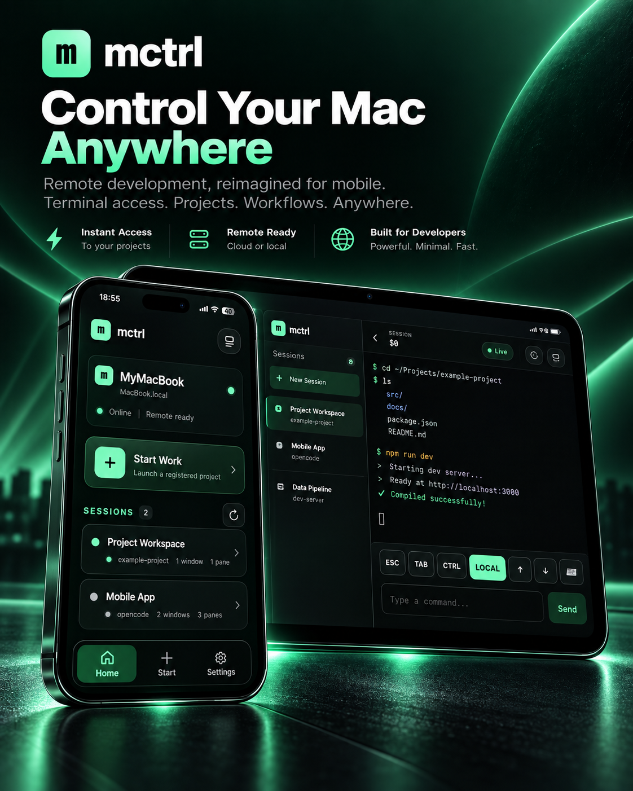
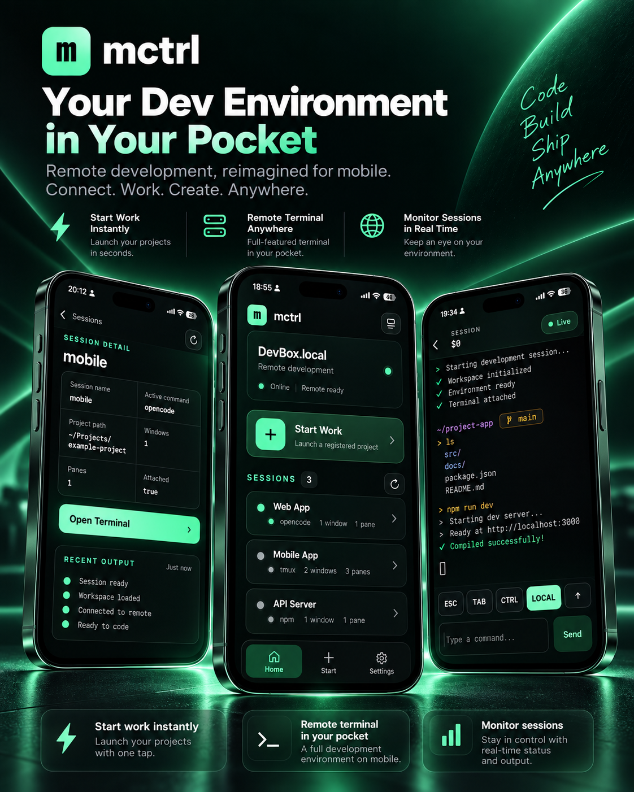
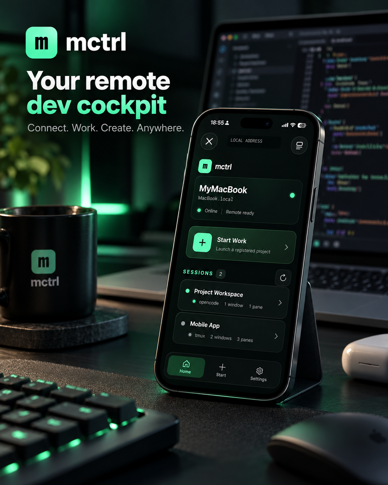

<div align="center">

# mctrl

### Your Dev Environment in Your Pocket

**Connect. Work. Create. Anywhere.**

[](https://github.com/liamamilin/mctrl/actions/workflows/ci.yml)
[](go.mod)
[](https://github.com/liamamilin/mctrl)
[](LICENSE)

mctrl is a mobile control surface for terminal work running on your Mac.
Observe existing tmux sessions, intervene when needed, and launch durable
Managed Work from your iPhone—without moving execution into the cloud.

<p align="center">
  
</p>

<p align="center">
  
  
</p>

</div>

---

## What is mctrl?

mctrl is **not** an SSH client, cloud IDE, or remote desktop.

It is a focused control plane for a Mac that is already running your development
environment:

- **Resume** an existing tmux session from your phone.
- **Observe** recent terminal output without taking over the desktop.
- **Intervene** through a real terminal when a task needs attention.
- **Launch** registered Projects through Shell, Codex, or OpenCode runners.
- **Continue working** after the browser closes, the phone locks, or the daemon
  restarts.

> The computer does the work. The phone starts, observes, and intervenes.

## Highlights

| | |
|---|---|
| **Observe & Resume** | Discover real tmux Sessions, active commands, working directories, windows, panes, and recent output. |
| **Managed Work** | Launch a registered Project with a Runner and Prompt while `mctrl-runner` owns the real child process. |
| **Durable by design** | Work survives phone disconnects and daemon restarts; tmux remains the source of Session truth. |
| **Terminal escalation** | `LOCAL` provides a readable interactive viewport. `FULL` fits, zooms, and pans the complete desktop-sized pane. |
| **Safe prompting** | Structured Prompt actions are idempotent. Raw terminal input is never replayed after uncertain delivery. |
| **Power protection** | Configurable macOS power assertions protect active Work without promising to wake an unreachable Mac. |
| **Pairing that stays useful** | A browser stays paired for 30 days. Safari and the installed PWA can share one device record through a short-lived browser link. |
| **Mac pairing launcher** | A lightweight `Mctrl Pair.app` opens a QR Pair Console—no terminal required after initial setup. |

## Requirements

- macOS on Apple Silicon or Intel
- macOS logged in and reachable from the phone
- Go **1.27.1**
- Node.js **22+**
- tmux **3.7c** or compatible
- iPhone Safari or installed PWA

## Quick Start

### 1. Build and verify

```sh
git clone git@github.com:liamamilin/mctrl.git
cd mctrl
make release-check
```

`make release-check` rebuilds the PWA, embeds frontend assets, runs Go tests,
`go vet`, the race detector, TypeScript checks, CLI smoke tests, the macOS pairing
launcher check, and binary checksums.

### 2. Initialize mctrl

Loopback-only mode is the default:

```sh
./bin/mctrl setup
```

For a phone on a private trusted LAN:

```sh
./bin/mctrl setup --lan
```

The setup command installs a macOS LaunchAgent. After login, launchd starts and
maintains the daemon.

### 3. Pair the iPhone

Build the lightweight Finder launcher:

```sh
make mac-launcher
open 'dist/Mctrl Pair.app'
```

The launcher opens a Mac-only Pair Console with:

- a QR code;
- a copyable one-time pairing code;
- a manual pairing address for devices that cannot scan.

The equivalent CLI is:

```sh
./bin/mctrl pair --open
```

### 4. Register a Project

```sh
./bin/mctrl project add /path/to/project --name 'My Project'
./bin/mctrl project list
```

Open **Start Work** on the phone, select the Project and Runner, enter a Prompt,
and launch.

## Everyday CLI

```sh
mctrl status                 # daemon, transport, Sessions, Projects, devices
mctrl doctor                 # local diagnostics
mctrl pair                   # print a one-time phone Pair URL and QR
mctrl pair --open            # open the Mac Pair Console
mctrl project list           # list registered Projects
mctrl devices                # show active and revoked device audit records
mctrl restart                # restart only the daemon
mctrl uninstall              # stop mctrl without deleting arbitrary tmux Sessions
```

## Transport Profiles

### Trusted-LAN HTTP

Zero external dependency. Intended only for a private, trusted network.

> **Warning:** plain HTTP provides no end-to-end confidentiality. A malicious
> or actively monitored LAN may observe or tamper with traffic.

### TLS-Terminated HTTPS/WSS

Use a trusted TLS endpoint such as Tailscale Serve or a user-controlled reverse
proxy:

```sh
mctrl setup \
  --transport tls_terminated \
  --public-url https://mctrl.example.internal
```

The public URL must be the exact browser-facing origin.

## Architecture at a Glance

```text
iPhone Safari / installed PWA
              │
       HTTPS / WSS or Trusted-LAN HTTP
              │
        mctrl daemon (Go)
        ├── pairing + device auth
        ├── REST + terminal WebSocket bridge
        ├── Project + Runner registry
        ├── Work lifecycle + recovery journal
        ├── power assertions
        └── tmux adapter
                  │
          durable tmux Sessions
                  │
             mctrl-runner
                  │
        Shell / Codex / OpenCode
```

The daemon is a control plane. `mctrl-runner` owns the Work child process, and
tmux owns Session persistence.

## Security Model

mctrl grants a paired phone highly privileged terminal access as the current
macOS user. The implementation includes:

- short-lived, one-time pairing tokens;
- salted credential and Session hashes;
- 30-day browser Sessions;
- strict Origin and CSRF validation for browser mutations;
- WebSocket revocation;
- active device records plus collapsed revoked history;
- two-minute, single-use browser-link tokens for Safari/PWA linking;
- no arbitrary `/execute` endpoint;
- no automatic replay of raw terminal input or uncertain Prompts.

Read [`SECURITY.md`](SECURITY.md) and
[`TRANSPORT_SECURITY.md`](TRANSPORT_SECURITY.md) before deployment.

## Development

```sh
make build          # rebuild PWA, embed assets, then build both Go binaries
make test           # Go tests + vet + strict TypeScript
make test-race      # race detector, including real tmux integration
make release-check  # complete deterministic release gate
```

Frontend development:

```sh
cd web
npm ci
npm run dev
```

Documentation:

- [`DEVELOPMENT.md`](DEVELOPMENT.md)
- [`ARCHITECTURE.md`](ARCHITECTURE.md)
- [`PRODUCT.md`](PRODUCT.md)
- [`API.md`](API.md)
- [`WEBSOCKET.md`](WEBSOCKET.md)
- [`TEST_PLAN.md`](TEST_PLAN.md)
- [`TROUBLESHOOTING.md`](TROUBLESHOOTING.md)
- [`VALIDATION.md`](VALIDATION.md)

## Repository Layout

```text
cmd/mctrl/             daemon and CLI
cmd/mctrl-runner/      Managed Work process owner
internal/api/          REST, WebSocket, static PWA serving
internal/auth/         pairing, browser Sessions, device linking
internal/config/       validated configuration
internal/project/      Project registry
internal/runner/       Shell/Codex/OpenCode runner registry
internal/tmux/         tmux lifecycle adapter
internal/work/         durable Work records and recovery
web/                   Preact + TypeScript PWA
packaging/macos/       macOS pairing launcher assets
scripts/               build and release scripts
```

## Current Status

`0.1.0-dev` · V1 Final

The real-iPhone Trusted-LAN path has been exercised. Playwright Chromium/WebKit,
a final TLS/WSS deployment, and authenticated Codex/OpenCode Runner integration
remain environment-specific release gates.

## License

[MIT](LICENSE) © 2026 liamamilin
